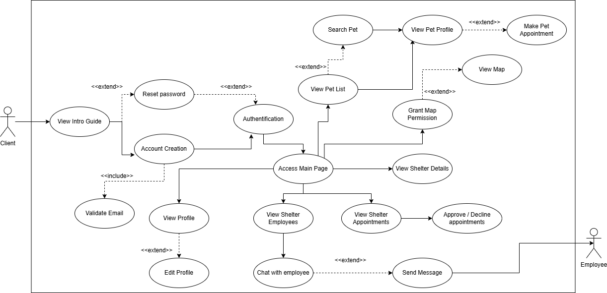
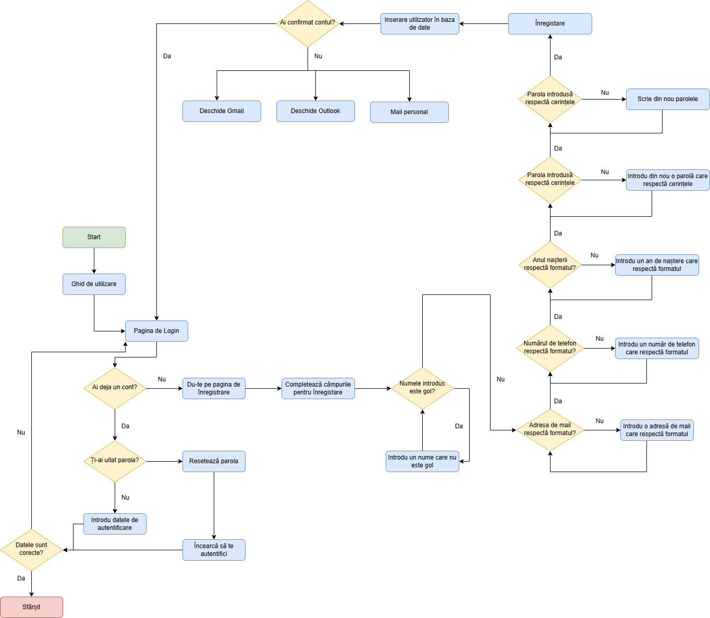
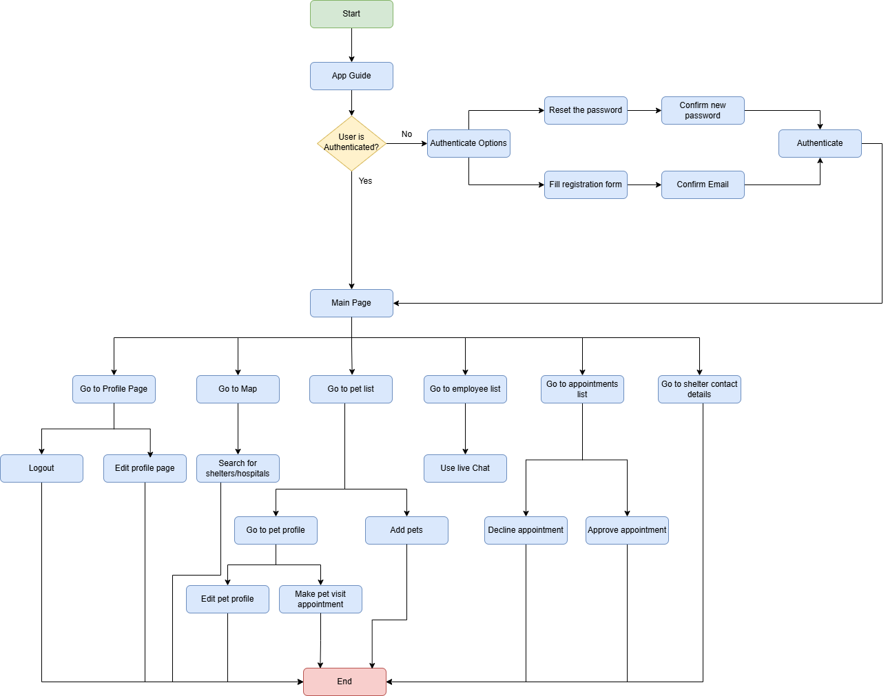
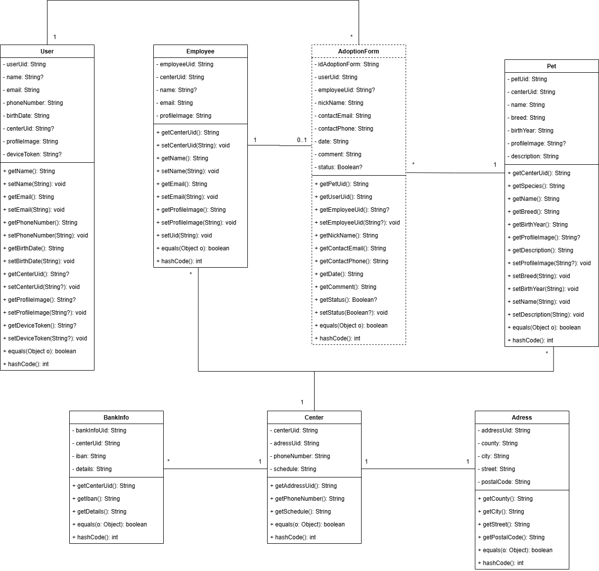
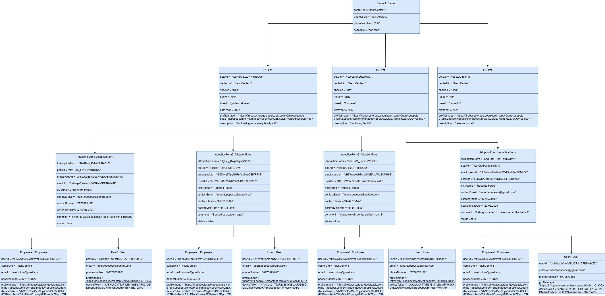
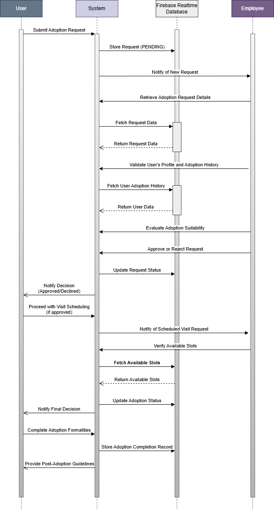

# RescuePets

## Obiectiv

Trăim într-o eră digitală în continuă evoluție, în care găsirea unui animal de companie poate deveni o provocare reală. Potrivit statisticilor, aproximativ 400 de milioane de animale fără stăpân se confruntă cu situația suprapopulării, iar anual aproape 3 milioane dintre acestea sunt eutanasiate în adăposturi, din cauza dificultății de a găsi un cămin.  
Din dorința de a contribui la reducerea acestor probleme, RescuePets își propune să faciliteze procesul de adopție printr-o aplicație mobilă sigură, ușor de utilizat și interactivă. Astfel, utilizatorii pot comunica în timp real cu angajații centrelor, pot explora profilurile detaliate ale animalelor și își pot programa vizitele la adăposturi, totul într-un mod structurat și transparent.  
Proiectul pune accent pe un design modern și prietenos (Material Design), pe securitatea datelor (stocarea parolelor prin hashing și autentificare pe bază de roluri) și pe funcționalități inovatoare (chat în timp real, managementul vizitelor, baze de date locale și online, suport offline). Prin aceste abordări, RescuePets vizează îmbunătățirea semnificativă a șanselor de adopție și, implicit, a calității vieții atât pentru animale, cât și pentru iubitorii acestora.

## Cerințe Funcționale

| **Cerință**                                                                                                       | **Justificare**                                                                                                                                          |
|-------------------------------------------------------------------------------------------------------------------|-----------------------------------------------------------------------------------------------------------------------------------------------------------|
| Trebuie să pot crea un cont (înregistrare)                                                                        | Pentru a accesa funcționalitățile platformei.                                                                                                             |
| Trebuie să mă pot autentifica și să îmi pot reseta parola                                                         | Pentru a-mi menține securizat contul și a putea recupera accesul dacă am uitat parola.                                                                     |
| Trebuie să pot autentifica/inregistra cu contul de Google                                                          | Pentru a facilita accesul rapid și convenabil, folosind serviciile Google.                                                                                 |
| Trebuie să pot vizualiza și actualiza profilul meu (nume, email, telefon, poză etc.)                              | Pentru a menține informațiile mele personale corecte și actualizate.                                                                                      |
| Trebuie să pot căuta și vizualiza detalii despre animalele disponibile (specie, rasă, vârstă, descriere, imagini) | Pentru a găsi mai ușor animalul potrivit nevoilor și preferințelor mele.                                                                                  |
| Trebuie să pot trimite cereri de programare la centrul de animale (pentru vizită/adopție)                          | Pentru a stabili data și ora vizitei în adăpost și a facilita procesul de adopție.                                                                        |
| Trebuie să pot vedea statusul cererilor de programare (în așteptare, aprobat, respins)                             | Pentru a fi la curent cu evoluția și rezultatul solicitărilor mele.                                                                                       |
| Trebuie să pot comunica în timp real cu un angajat (chat/asistent virtual)                                         | Pentru a primi informații și sfaturi rapide despre procesul de adopție sau îngrijirea animalelor.                                                         |
| Trebuie să pot primi notificări despre evenimente majore (primire mesaj chat, adopție, aprobare cerere, respingere cerere)            | Pentru a fi informat în timp util și a nu pierde informații importante.                                                                                   |
| Trebuie să pot posta anunțuri (în cazul în care doresc să dau spre adopție un animal)                              | Pentru a facilita găsirea unui nou stăpân și a oferi vizibilitate anunțurilor mele.                                                                        |
| Trebuie să pot vizualiza și filtra animalele după numele acestora, rasă, specie, anul nașterii                          | Pentru a găsi cât mai rapid ce animale satisfac dorințele mele.                                                                        |
| Trebuie să pot încărca și actualiza imagini cu animalele (doar pentru angajați)                                   | Pentru a menține informațiile din platformă la zi și a prezenta animalele cât mai atractiv.                                                               |
| Trebuie să pot aproba sau respinge cererile de programare (doar pentru angajați)                                   | Pentru a organiza vizitele și a valida cererile de adopție în mod controlat.                                                                              |
| Trebuie să pot vedea istoricul cererilor trimise (utilizator) sau istoricul cererilor primite (angajat)           | Pentru a urmări evoluția adopțiilor și a ține evidența programărilor.                                                                                     |                                                                                     |
| Trebuie să pot vedea informațiile de contact și programul centrului de animale                                    | Pentru a putea contacta centrul și a ști când este disponibil.                                                                                            |
| Trebuie să pot dona sau sponsoriza un centru de animale                                                           | Pentru a susține financiar adăpostul și a contribui la îngrijirea animalelor fără stăpân.                                                                  |
| Trebuie să am un tab cu tutorial video al aplicației                                                              | Pentru a învăța mai ușor cum se folosește aplicația și a vedea funcționalitățile în acțiune.                                                              |

---

## Cerințe Non-Funcționale

- **Interfață și UX**  
  Aplicația trebuie să fie intuitivă și ușor de utilizat, cu o organizare clară a elementelor și aliniată la principiile Material Design.

- **Performanță**  
  Paginile și funcționalitățile principale (ex.: căutare animale, vizualizare profil) trebuie să se încarce în câteva secunde pentru a nu afecta experiența utilizatorilor.

- **Scalabilitate**  
  Arhitectura (MVVM + Clean Architecture) trebuie să permită extinderea ușoară a funcționalităților și gestionarea unui număr mare de utilizatori/conexiuni simultane.

- **Securitate**  
  Parolele utilizatorilor trebuie stocate prin algoritmi de hash, iar accesul la date și funcționalități trebuie să fie controlat prin roluri (utilizator simplu/angajat).

- **Disponibilitate și Reziliență**  
  Aplicația trebuie să funcționeze și în modul offline, folosind o bază de date locală (Room) care să mențină o copie a datelor din Firebase.

- **Compatibilitate**  
  Aplicația trebuie să ruleze pe dispozitive cu sistem de operare Android, începând de la API 26 (Android 8.1) și până la versiunile recente (Android 14).

- **Mentenabilitate**  
  Codul trebuie să fie organizat pe principii solide (MVVM, repository pattern, dependency injection etc.) pentru a facilita întreținerea și actualizările ulterioare.

## Demo al aplicației
Puteți vizualiza live demo-ul aplicației aici: [Demo RescuePets](https://youtu.be/vRH2wFSKh0k?si=2nDVV-J5v8W1W_HB)

Sau dacă apasați pe imaginea de mai jos:

## Diagrama bazei de date
### Diagrama Entitate-Relație (ERD)

### Diagrama Conceptuală

## Diagrama Use-Case
Diagrama generală a proiectului

## Diagrama de flux
### Diagrama de flux pentru procesul de autentificare, înregistrare, resetare parolă
Pentru a înțelege mai bine fluxul de lucru al aplicației am realizat diagramele de flux 
pentru procesul de autentificare, înregistrare și resetare a parole (Figura 3.7), precum și cel 
general de utilizare al aplicației

### Diagrama de flux general al aplicației

## Diagrama de clase
Diagrama de clase pentru modelele din baza de date reprezintă structura entităților, atributele acestora și relațiile dintre ele. Fiecare clasă corespunde unui tabel din baza de date, având atribute (coloane) și asocieri (chei externe). Aceasta ajută la înțelegerea arhitecturii bazei de date și a conexiunilor dintre entități.

## Diagrama de obiecte
Diagrama de obiecte este o instanțiere a diagramei de clase, reprezentând obiectele concrete și valorile atributelor lor la un moment dat. Aceasta oferă o imagine detaliată a modului în care datele sunt stocate și interconectate în timpul execuției aplicației.
Pe baza diagramei pe care ai furnizat-o, diagrama de obiecte prezintă instanțele efective ale entităților precum Center, Pet, User, Employee și AdoptionForm, cu valori specifice pentru fiecare atribut. Obiectele sunt conectate între ele conform relațiilor definite în diagrama de clase, de exemplu:
- Un centru de adopție (Center) are mai multe animale (Pet) asociate.
- Un utilizator (User) și un angajat (Employee) sunt legați de formularele de adopție (AdoptionForm).
- Fiecare formular de adopție conține referințe la animalul adoptat, utilizatorul care adoptă și angajatul care procesează cererea.

## Sequence Diagram
Diagrama de secvență prezintă pașii procesului de adopție, evidențiind interacțiunea dintre utilizator, sistem, baza de date și angajați. Utilizatorul trimite o cerere, sistemul o stochează și notifică angajatul, care verifică datele și decide aprobarea sau respingerea. Dacă este aprobată, se programează o vizită, iar după finalizare, adopția este completată și utilizatorul primește instrucțiuni post-adopție.

## Design patterns

